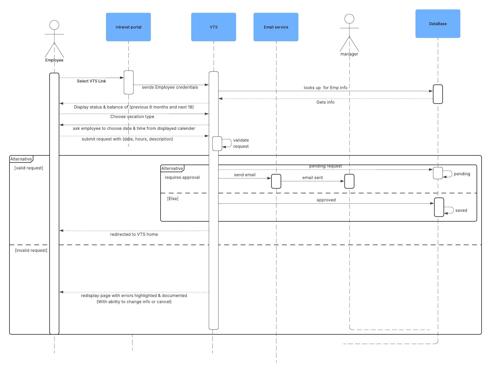
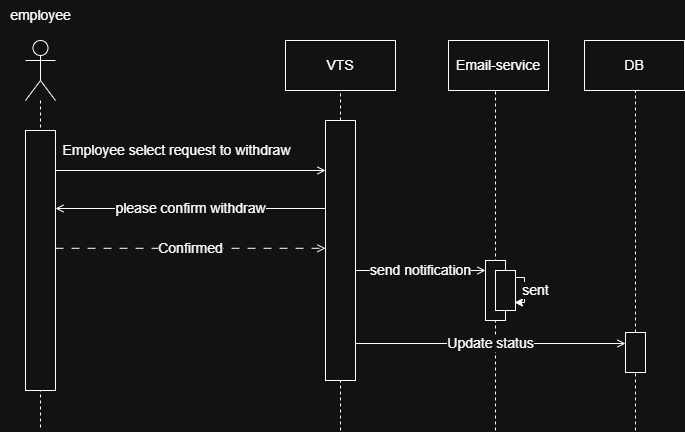
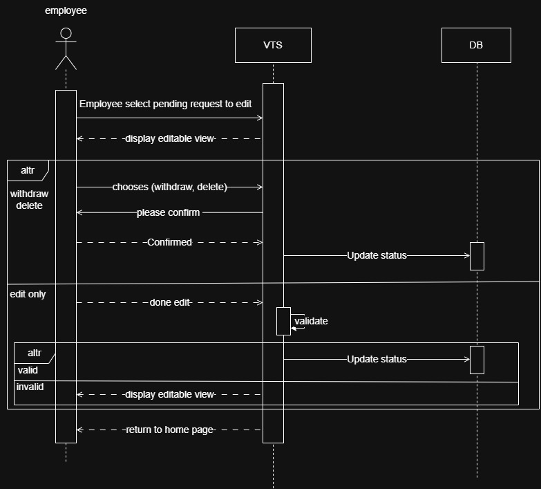
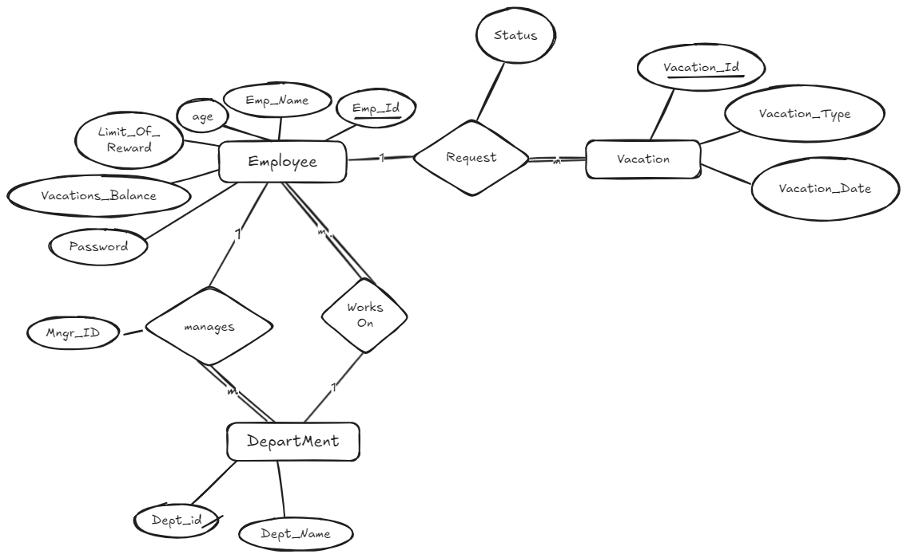
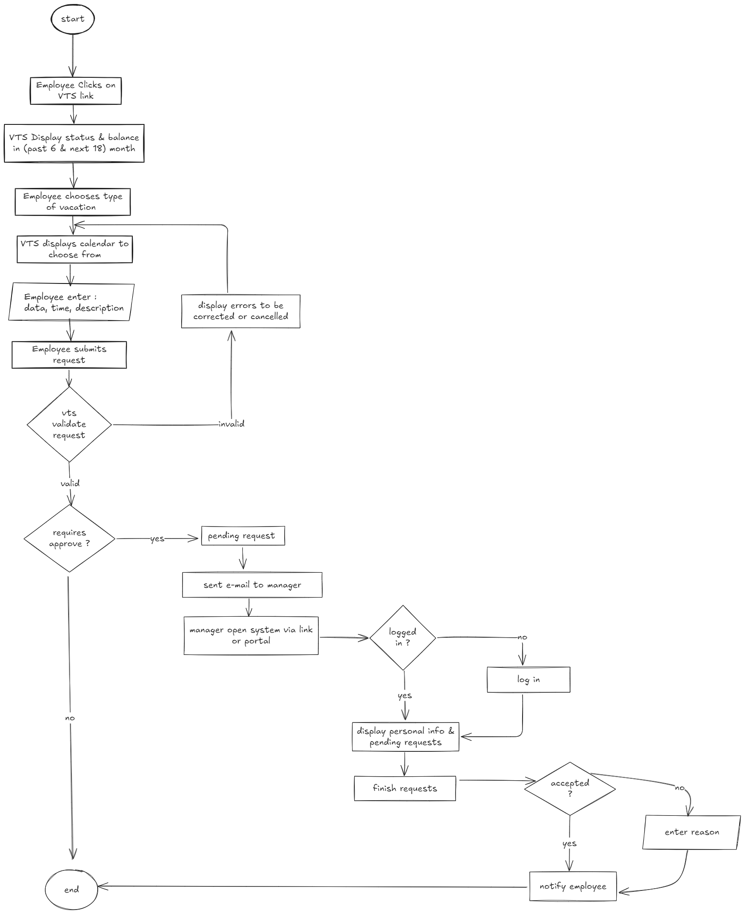

# Vacation-Tracking-System

## Table of Contents

- [Domain](#domain)
- [Vision](#vision)
- [Functional Requirements](#functional-requirements)
- [Non-Functional Requirements](#non-functional-requirements)
- [Constraints](#constraints)
- [Actors](#actors)
- [Sequence Diagram](#sequence-diagram)
  - [Employee](#employee-)
  - [Manager](#manager-)
- [ERD](#erd-)
- [FlowChart](#flowchart-)
----
## Domain

In many companies today, employees face a time-consuming and inefficient process when requesting vacation time. They must go through several manual steps and wait days to complete a simple task that could otherwise take only minutes. This inefficiency leads to wasted effort and delays.

## Vision

The **Vacation Tracking System (VTS)** aims to replace the manual and lengthy vacation request process with a digital solution. It provides employees with a way to manage and track their vacation time requests without needing to understand complex rules or company policies—giving them a sense of empowerment.
Additionally, the system reduces manual workload for the HR department and minimizes non-core managerial tasks that are not directly related to the company’s core business operations.

## Functional Requirements

1. **Employees** can:
   - Create vacation time requests.
   - View their requests from the past 6 months up to 18 months into the future.
   - Cancel their own requests.

2. **Managers** can:
   - Approve or reject vacation requests.
   - Award personal leave time to employees within predefined limits.

3. The system will:
   - Send email notifications for:
     - Requesting manager approval.
     - Notifying employees of request status updates.
   - Validate and verify leave requests against company policies and rules.
   - Provide a Web Service API for integration with other internal systems.
   - Interface with legacy HR systems to retrieve and update employee data.
   - Log all transactions for auditing and traceability.
   - Allow HR and System Admins to override restricted actions with proper logging.

## Non-Functional Requirements

1. **Usability**: The system should be user-friendly and intuitive.
2. **Security**: Authentication must be handled through the existing single-sign-on mechanism.
3. **Reusability**: The system must leverage existing hardware and middleware.

## Constraints

1. Must be implemented as an extension of the existing intranet portal.
2. Must use existing hardware and middleware components.
3. Must rely on the portal’s single-sign-on system for all authentication.

## Actors

1. **Employee**: A user who manages their own vacation requests (create, view, cancel).
2. **Manager**: Has all employee permissions plus the ability to approve/reject requests and grant leave (within system-defined limits).
3. **Clerk (HR)**: Can view and manage employee data and perform administrative tasks like adding or removing records.
4. **System Administrator**: Responsible for system maintenance, log file collection, and technical resources (web servers, databases, etc.).

## Sequence Diagram

1. Employee :

2. Manager :

3.Request
   a. withdraw request
   

   b. edit pending request
   

   c. Cancel request
   

## ERD :

## FlowChart :

1. Employee
   

2.

