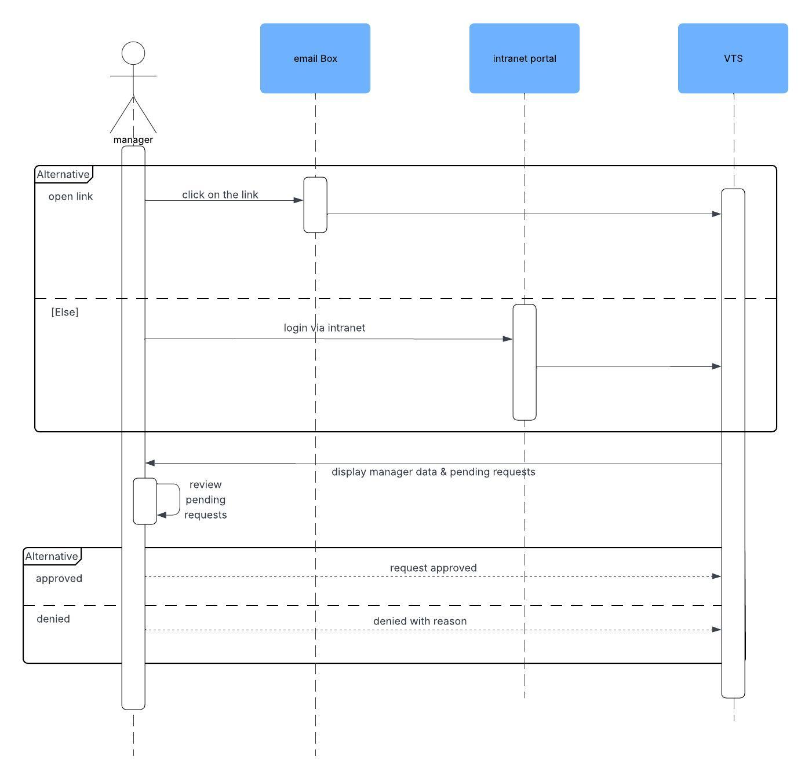
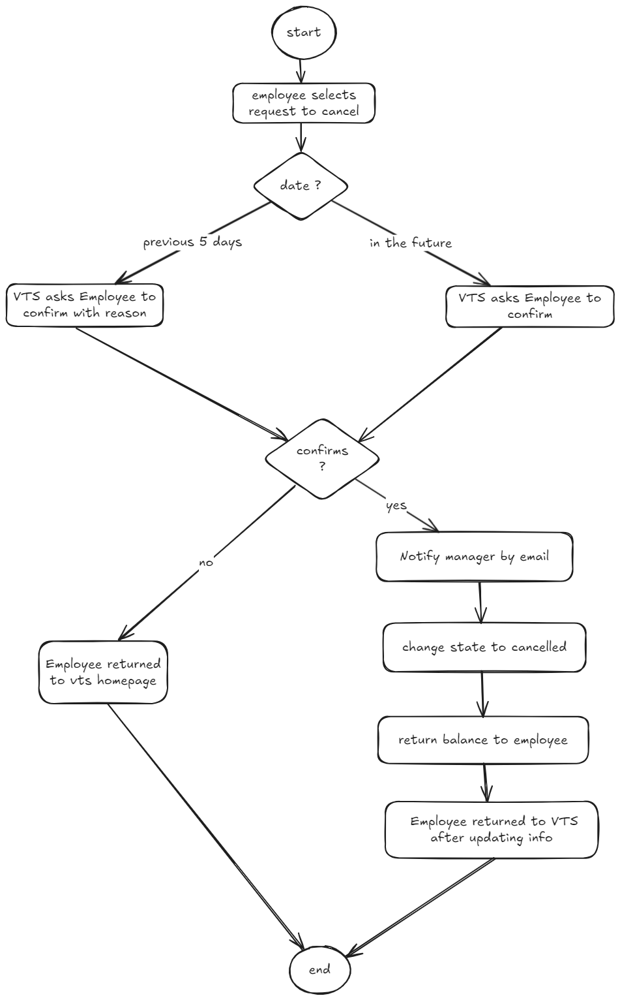

# Vacation-Tracking-System

## Table of Contents

- [Introduction](#introduction)
- [Domain](#domain)
- [Vision](#vision)
- [Functional Requirements](#functional-requirements)
- [Non-Functional Requirements](#non-functional-requirements)
- [Constraints](#constraints)
- [Actors](#actors)
- [Sequence Diagrams](#sequence-diagrams)
- [Entity Relationship Diagram (ERD)](#entity-relationship-diagram-erd)
- [Flowcharts](#flowcharts)

---

## Introduction

**Vacation Tracking System (VTS)** is an internal application designed to streamline and digitize the process of requesting, approving, and managing employee vacations within a company.

---

## Domain

Many companies rely on outdated and manual methods for handling vacation requests. Employees are often forced to navigate inefficient processes, involving paperwork and delays, just to request time off. This system aims to modernize that experience.

---

## Vision

The **Vacation Tracking System (VTS)** replaces the manual vacation process with a simple, fast, and digital alternative. It empowers employees to manage their vacations easily and relieves HR and managers from unnecessary administrative burdens. VTS also integrates with existing systems to ensure seamless data management.

---

## Functional Requirements

### Employees can:
- Submit vacation requests.
- View their requests from the past 6 months up to 18 months into the future.
- Cancel their own requests.

### Managers can:
- Approve or reject requests.
- Grant personal leave to employees (within policy-defined limits).

### The system will:
- Send email notifications for:
  - Manager approval requests.
  - Request status updates to employees.
- Validate leave requests based on company policy.
- Provide a Web Service API for internal integrations.
- Interface with legacy HR systems for data synchronization.
- Log all transactions for auditing purposes.
- Allow HR and System Admins to override restricted actions (with logging).

---

## Non-Functional Requirements

- **Usability**: Intuitive and user-friendly interface.
- **Security**: Integrated with existing single-sign-on (SSO).
- **Reusability**: Leverage existing hardware/middleware.

---

## Constraints

- Must be integrated within the existing intranet portal.
- Should utilize current infrastructure (hardware & middleware).
- Authentication must rely on the existing SSO system.

---

## Actors

| Actor              | Description                                                                 |
|-------------------|-----------------------------------------------------------------------------|
| **Employee**       | Can request, view, and cancel their own vacations.                          |
| **Manager**        | Can perform employee actions + approve/reject requests + grant leave.       |
| **Clerk (HR)**     | Manages employee data and admin records.                                    |
| **System Admin**   | Handles system operations and technical maintenance (e.g., logs, servers).  |

---

## Sequence Diagrams

### 1. Employee Actions

### 2. Manager Actions

### 3. Request Scenarios

- **Withdraw request**  
  

- **Edit pending request**  
  

- **Cancel request**  
  

---

## Entity Relationship Diagram (ERD)

This diagram outlines the relationships between system entities such as `Employee`, `Request`, `Manager`, etc.

---

## Flowcharts

### 1. General Employee Flow

### 2. Withdraw Request Flow

### 3. Edit Pending Request Flow

### 4. Cancel Request Flow

---

